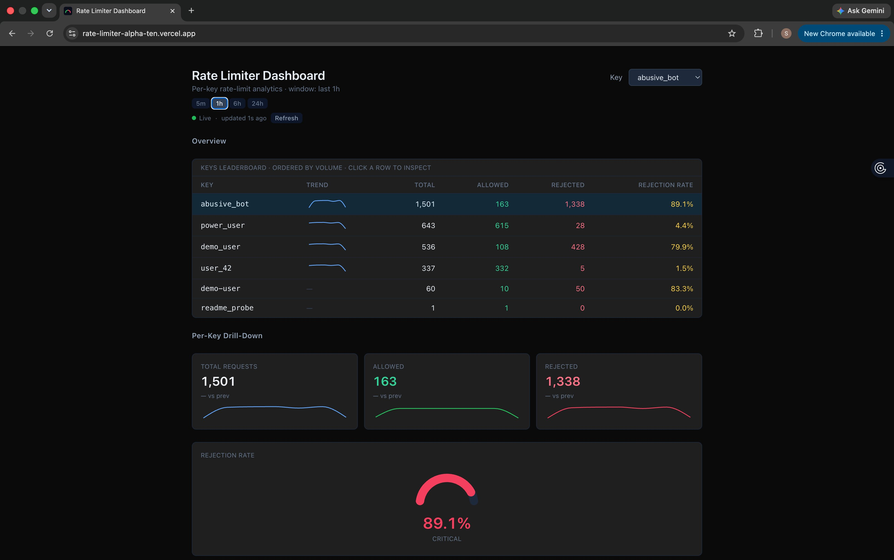
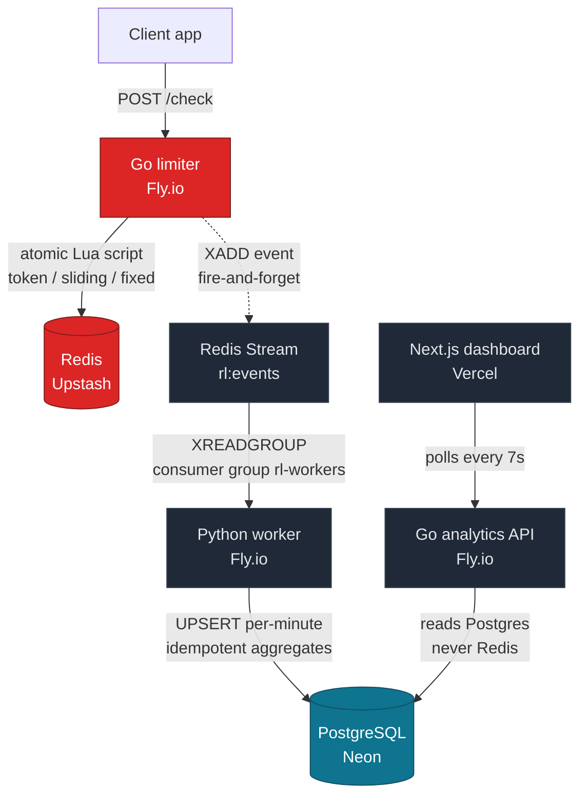
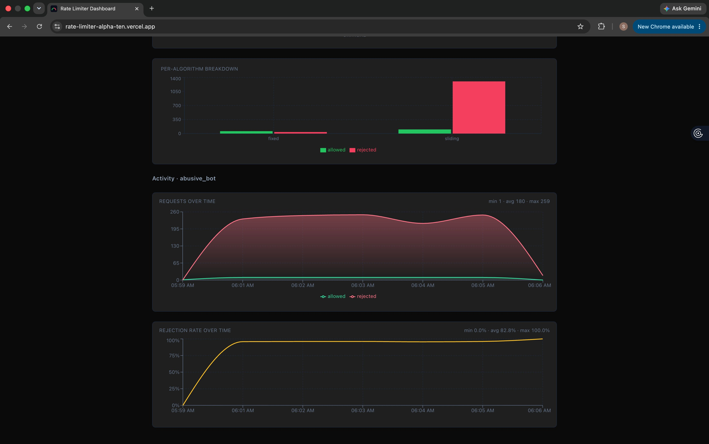

# Rate Limiter + Analytics System

A distributed rate-limiting microservice with an end-to-end analytics pipeline and a live dashboard.

[](https://go.dev/)
[](https://www.python.org/)
[](https://nextjs.org/)
[](https://redis.io/)
[](https://www.postgresql.org/)
[](https://www.docker.com/)

A Go + Redis rate limiter exposes `/check` for three algorithms — token bucket, sliding window, and fixed window — each implemented as an atomic Redis Lua script so state stays consistent under concurrent calls without distributed locks. Every decision is published to a Redis Stream, consumed by a Python worker that lands events in PostgreSQL and rolls them up into per-minute aggregates. A Go analytics API reads those aggregates, and a Next.js dashboard polls the API to render live totals, per-key timeseries, and rejection rates.

**Live dashboard:** https://rate-limiter-alpha-ten.vercel.app  
**Live API:** https://rate-limiter-shahanb06.fly.dev



## Table of contents

- [For Developers - Integration](#for-developers---integration)
- [For Operators - Dashboard](#for-operators---dashboard)
- [Architecture](#architecture)
- [Benchmarks](#benchmarks)
- [Running locally](#running-locally)
- [Repo layout](#repo-layout)
- [License](#license)

---

## For Developers - Integration

Call `/check` from your service before handling a request. Pass the client identifier as `key` and pick an `algorithm`; the limiter returns the decision in both the HTTP status and a JSON body.

```bash
curl -i -X POST "https://rate-limiter-shahanb06.fly.dev/check?key=user_42&algorithm=fixed&limit=5&window=60"
```

An allowed request returns `200` with rate-limit headers and a JSON body:

```
HTTP/2 200
content-type: application/json
x-ratelimit-limit: 5
x-ratelimit-remaining: 4
x-ratelimit-reset: 1780918680

{"allowed":true,"remaining":4,"retry_after":0,"key":"user_42","algorithm":"fixed"}
```

When the limit is exceeded, `allowed` flips to `false` and `retry_after` reports the seconds to wait. You can branch on either the HTTP status or the `allowed` field.

**Parameters**

- `key` — the identifier being limited (per-user, per-IP, per-API-key — your choice)
- `algorithm` — `token`, `sliding`, or `fixed`
- `limit` — requests allowed per window
- `window` — window length in seconds

**Which algorithm to pick**

- **`fixed`** — simplest, lowest overhead. Counts requests in fixed time windows (e.g. 60s). Good default for most use cases.
- **`sliding`** — smoother and more accurate at window boundaries, slightly more state. Pick this when bursts at window transitions matter (e.g. tight per-second limits).
- **`token`** — token bucket. Allows controlled bursts above the average rate while keeping a long-term cap. Pick this when occasional spikes are acceptable but sustained overuse isn't.

> **Note:** the `key` is a public bucketing identifier — it appears on the analytics dashboard. Use a stable, non-sensitive value (a user ID, API-key ID, or IP). Don't pass raw secrets or personal data as the key.

**See it trip** — the first `limit` requests are allowed, the rest are rejected for the rest of the window:

```bash
for i in $(seq 1 7); do
  curl -s -X POST "https://rate-limiter-shahanb06.fly.dev/check?key=demo&algorithm=fixed&limit=5&window=60" \
    | python3 -c "import sys,json; d=json.load(sys.stdin); print(d['allowed'], d['remaining'])"
done
```

---

## For Operators - Dashboard

The dashboard at https://rate-limiter-alpha-ten.vercel.app polls the analytics API every 7 seconds and shows traffic in real time — no setup, just open it.

- **Keys leaderboard** — every active key ranked by volume, with a per-key trend sparkline, totals, and rejection rate
- **Summary tiles** — total / allowed / rejected for the selected key, each with its own sparkline
- **Rejection gauge** — a threshold-colored half-donut: green Healthy below 30%, amber Elevated 30–70%, red Critical above 70%
- **Per-algorithm breakdown** — allowed vs rejected, split by token / sliding / fixed
- **Timeseries + rejection-rate charts** — minute-grained, for the selected key

The analytics API is read-only and backed by Postgres, never Redis — so dashboard queries never touch the rate-limit hot path.

Read endpoints: `/analytics/keys`, `/analytics/summary`, `/analytics/timeseries`, `/analytics/leaderboard` (the leaderboard accepts a `?window=` parameter, e.g. `?window=24h`).

---

## Architecture



**Design choices worth knowing:**

- **Atomic Lua scripts.** All three algorithms run entirely inside Redis as Lua scripts, so rate-limit state stays consistent under concurrent `/check` calls without distributed locks. This is the core of the system.
- **Event sourcing decouples the hot path.** `/check` only fires an event into a Redis Stream; it never writes to Postgres. Analytics happen out of band, so heavy queries can never slow down a rate-limit decision.
- **Idempotent aggregation.** The worker consumes via a consumer group (at-least-once delivery) and writes absolute per-minute values rather than incrementing — recompute, don't add. The worker can restart or replay with no double-counting.
- **Read API isolated from Redis.** Analytics endpoints read only from Postgres, keeping the rate-limit hot path clean.
- **Postgres-optional limiter.** Because `/check` only writes to Redis (and pushes a fire-and-forget event), an outage in the analytics Postgres never affects rate-limit decisions. The limiter degrades gracefully: rate-limiting keeps working, only dashboard data goes stale until Postgres comes back.
- **Windowed comparisons on the dashboard.** Summary KPIs show current-window totals (5m / 1h / 6h / 24h) with a period-over-period delta versus the immediately preceding equal-length window. The aggregator's per-minute granularity is what makes arbitrary windowing cheap.

**Stack:** Go 1.25 · Redis (Upstash) · Python 3.10+ · PostgreSQL (Neon) · Next.js · Docker · deployed on Fly.io and Vercel.



---

## Benchmarks

Measured on a 2024 MacBook Air (M3) with Redis, Postgres, and the limiter all running in Docker on the same host, single limiter instance. Load generated by k6 (see `benchmarks/` and `k6-load-test.js`):

- ~844 req/s sustained
- ~5,000 req/s burst
- p95 ~2 ms on the `/check` hot path

Production throughput on Fly.io with Upstash Redis will differ. Re-run k6 against your own deployment for representative numbers.

---

## Running locally

The full stack — Redis, PostgreSQL, the Go limiter, and the Python worker — runs with one command, no environment setup required:

```bash
docker compose up
```

Compose starts Redis and Postgres with healthchecks, waits for both to be healthy, then builds and starts the limiter (on `localhost:8080`) and the worker. The Postgres schema is loaded automatically on first boot. Local credentials are baked into the compose file for convenience; production uses managed Redis (Upstash) and Postgres (Neon) with secrets injected at deploy time.

**Dashboard**

The Next.js dashboard runs separately from compose:

```bash
cd frontend && npm install && npm run dev
```

Open `http://localhost:3000`. The dev server defaults to `http://localhost:8080` for the backend, so no `NEXT_PUBLIC_API_BASE_URL` is needed when compose is running locally.

---

## Repo layout

```
backend/      — Go limiter + analytics API
worker/       — Python aggregation worker
frontend/     — Next.js dashboard
benchmarks/   — k6 load test scripts and notes
```

---

## License

MIT — see LICENSE.

